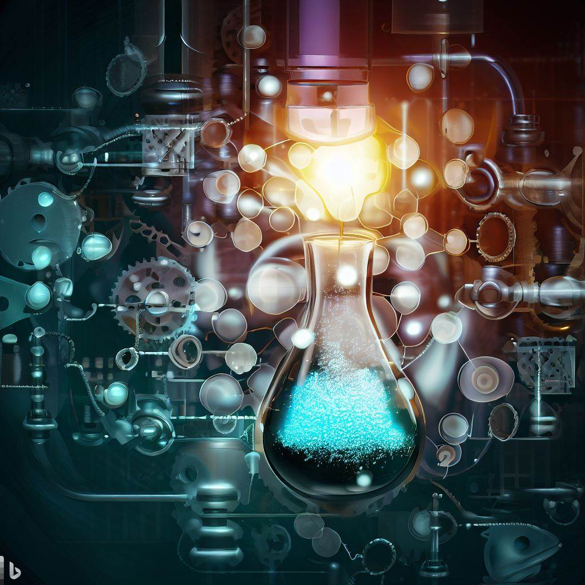
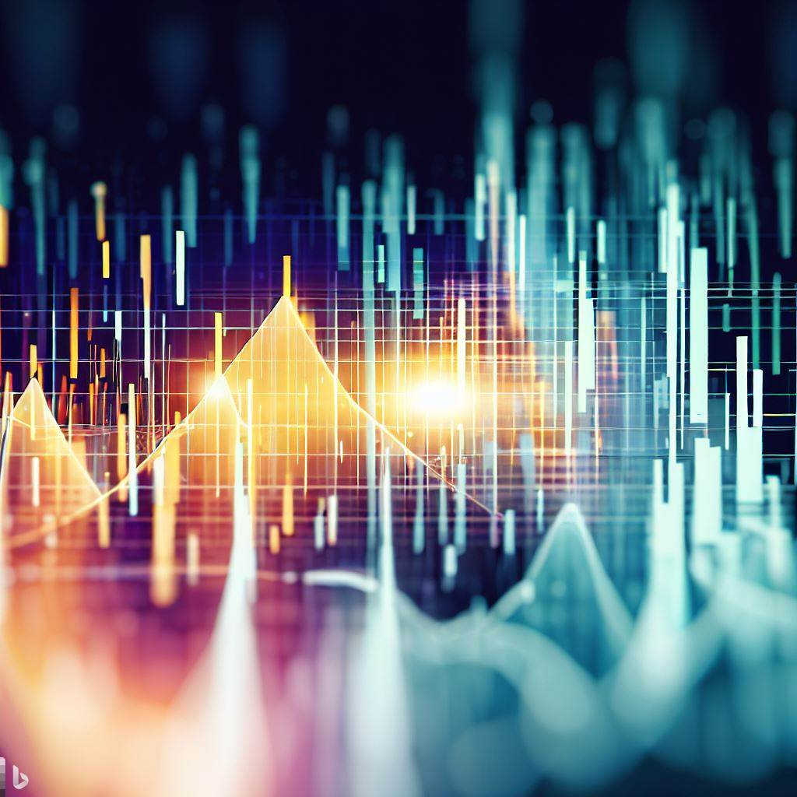

# 2023-NYCU-Data-Science

This is the repository for the 2023-NYCU-Data-Science course homework.

## Difficulties

|Homework|Difficulty (1-5 stars)|
|:---:|:---:|
|Homework 1|:star::star::star:|
|Homework 2|:star::star::star:|
|Homework 3|:star::star:|
|Homework 4|:star::star::star::star::star:|
|Homework 5|:star::star:|
|Homework 6|:star:|

## Homework 1

[Crawler / Popularity Predictor](./Homework%2001/README.md)

<table>
    <tr>
        <th>
            
        </th>
        <th>
            
        </th>
    </tr>
</table>

## Homework 2

[Model Compression](./Homework%2002/README.md)

<table>
    <tr>
        <th>
            
        </th>
        <th>
            
        </th>
    </tr>
</table>

## Homework 3

[Few-Shot Learning](./Homework%2003/README.md)

<table>
    <tr>
        <th>
            
        </th>
        <th>
            
        </th>
    </tr>
</table>

## Homework 4

[Crowd Estimation](./Homework%2004/README.md)

<table>
    <tr>
        <th>
            
        </th>
        <th>
            
        </th>
    </tr>
</table>

## Homework 5

[Headline Generation](./Homework%2005/README.md)

<table>
    <tr>
        <th>
            
        </th>
        <th>
            
        </th>
    </tr>
</table>

## Homework 6

[Graph Anomaly Detection](./Homework%2006/README.md)

<table>
    <tr>
        <th>
            
        </th>
        <th>
            
        </th>
    </tr>
</table>

## License

All images in README.md are generated from [DALL-E](https://www.bing.com/images/create/)